# Максим и Долина Динозавров

*Сказка для Максима, 3 года 9 месяцев*

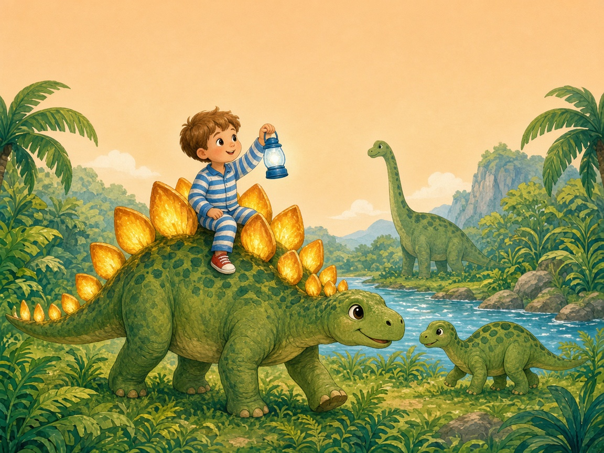

---

## 1

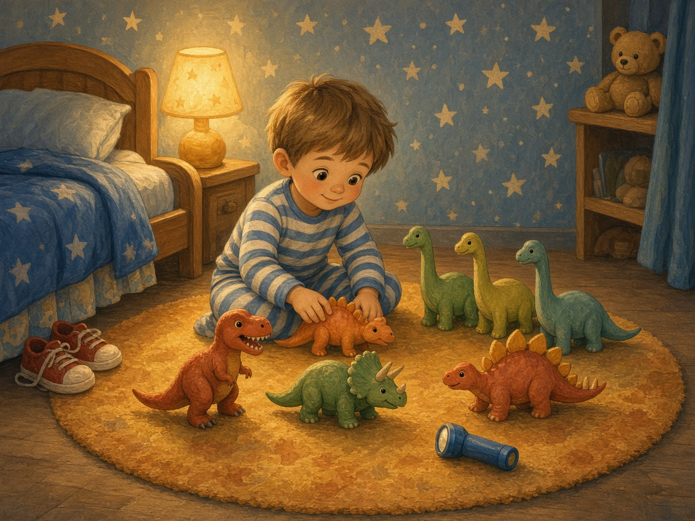

Жил-был мальчик Максим.

Максим очень любил динозавров.

А больше всех — Шипастика. У Шипастика на спине жёлтые пластинки.

Каждый вечер Максим клал Шипастика рядом с подушкой.

---

## 2

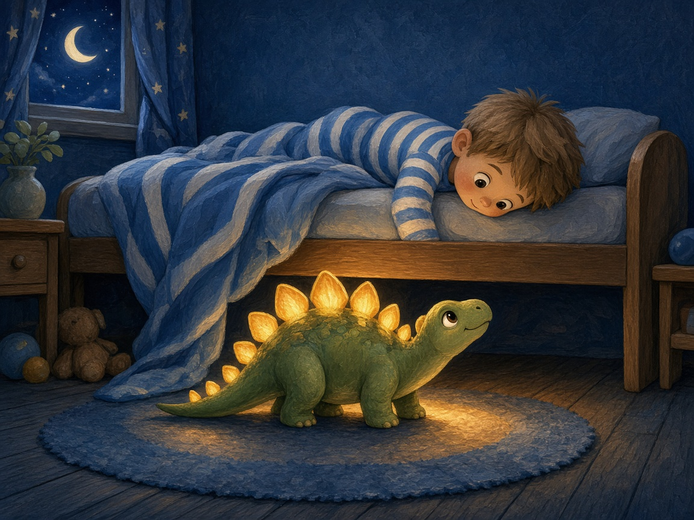

Ночью Максим услышал:

**— Тук. Тук-тук.**

Максим свесил голову с кровати. Под кроватью стоял Шипастик. Живой! А пластинки светились, как ночник.

— Максим, пойдём! Нам нужна помощь.

**— Я помогу! — сказал Максим.**

---

## 3

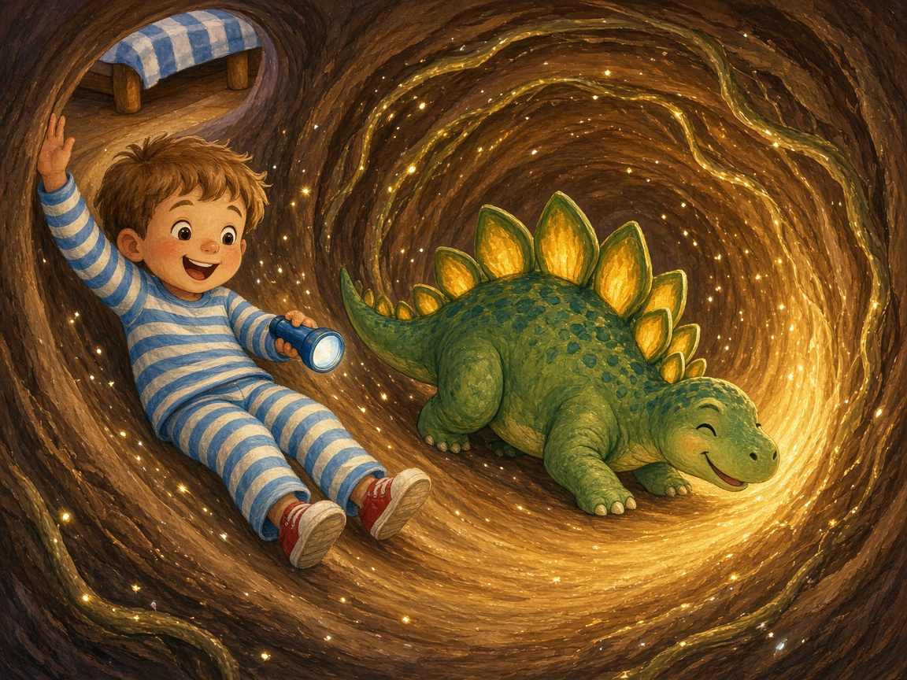

Под кроватью была дырка. Большая-пребольшая.

Как горка!

**— У-у-у-ух!**

И Максим поехал вниз.

---

## 4

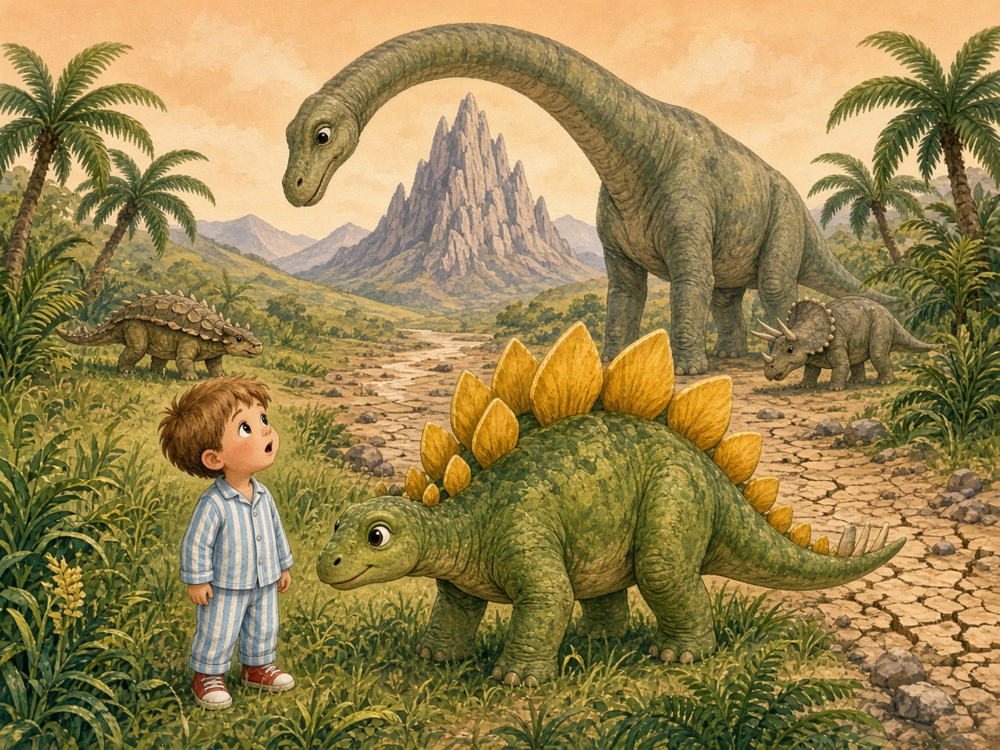

Трава тут была выше Максима. Небо — жёлтое, как абрикос.

А Шипастик стал огро-о-омный!

Длинношеий динозавр наклонил к Максиму голову:

— Здравствуй. Я Долговяз.

---

## 5

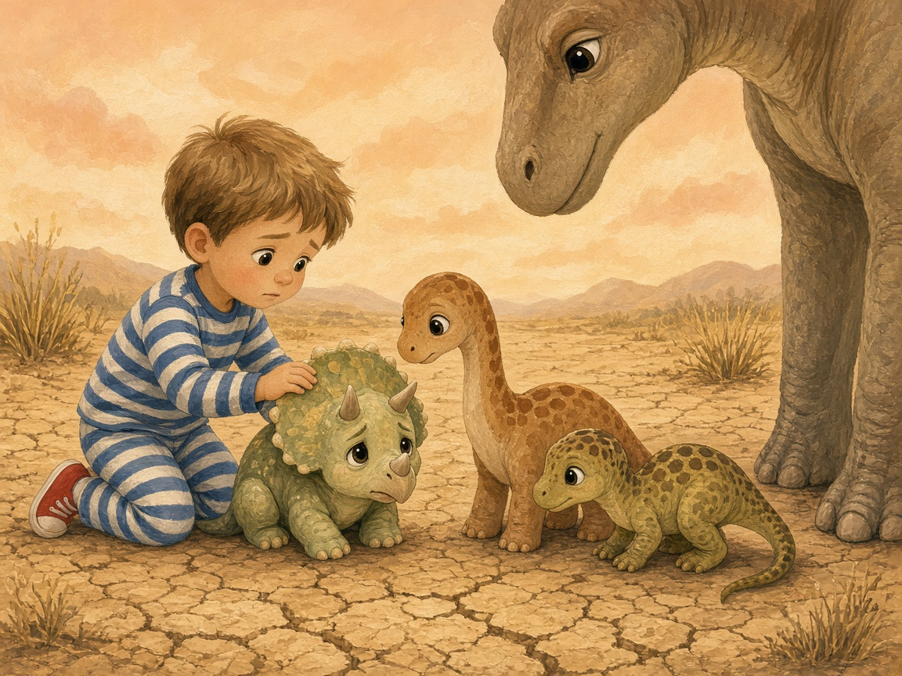

— У нас пропала речка, — вздохнул Долговяз. — Совсем-совсем. А малыши хотят пить.

Максим посмотрел. Речки не было. Только сухие камни.

А малыши сидели грустные-прегрустные.

**— Я помогу! — сказал Максим.**

---

## 6

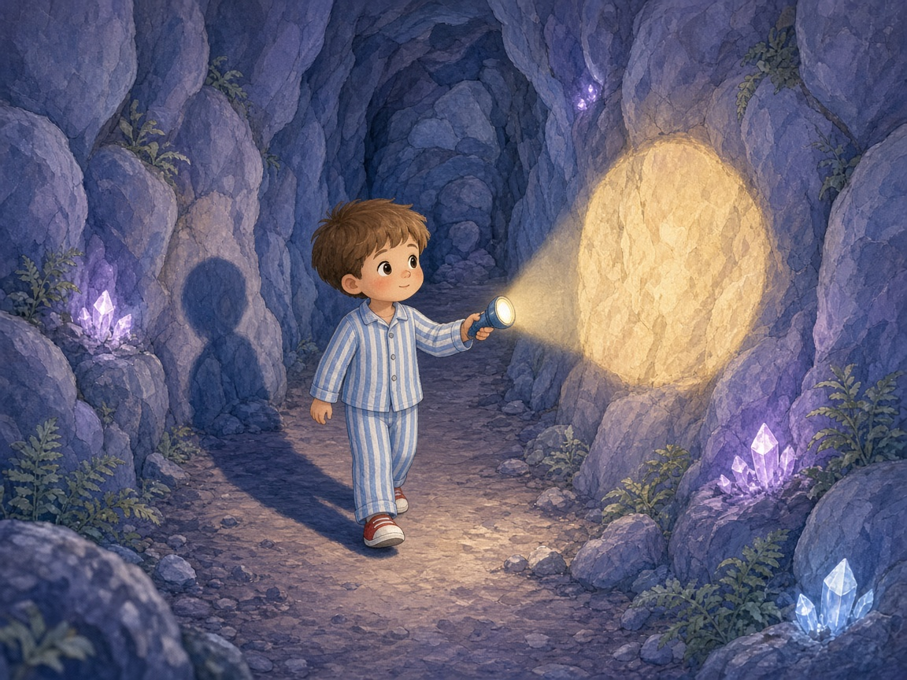

Речка убежала в ущелье. В узкое-узкое.

Большие туда не пролезут. А Максим пролезет!

Максим взял свой синий фонарик и пошёл.

**Топ. Топ. Топ.**

Было темно. Но фонарик светил.

---

## 7

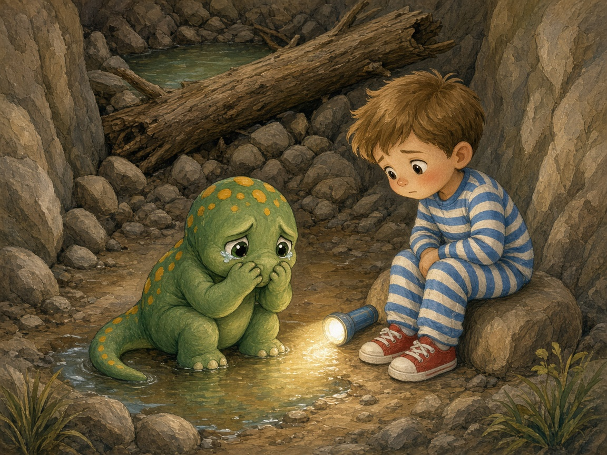

И вдруг Максим услышал: **«Ы-ы-ы-ы...»**

Кто-то плакал!

Это был маленький динозаврик. Зелёный, в жёлтых пятнышках.

— Я Пятныш. Я толкал камушек... а он толкнул бревно... и речка застряла!

— Не плачь, — сказал Максим. — Сейчас починим.

---

## 8

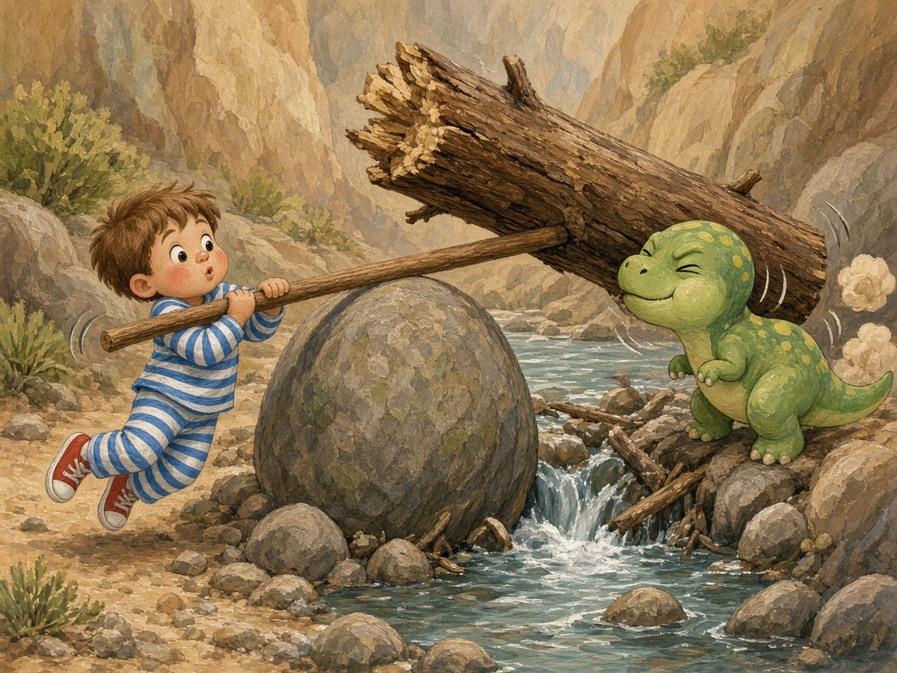

Максим взял длинную палку. Подложил круглый камень.

**— Раз-два — ВЗЯЛИ!**

Максим тянул. Пятныш толкал носом.

**— Раз-два — ВЗЯЛИ!**

И бревно — **кряк!** — поехало.

---

## 9

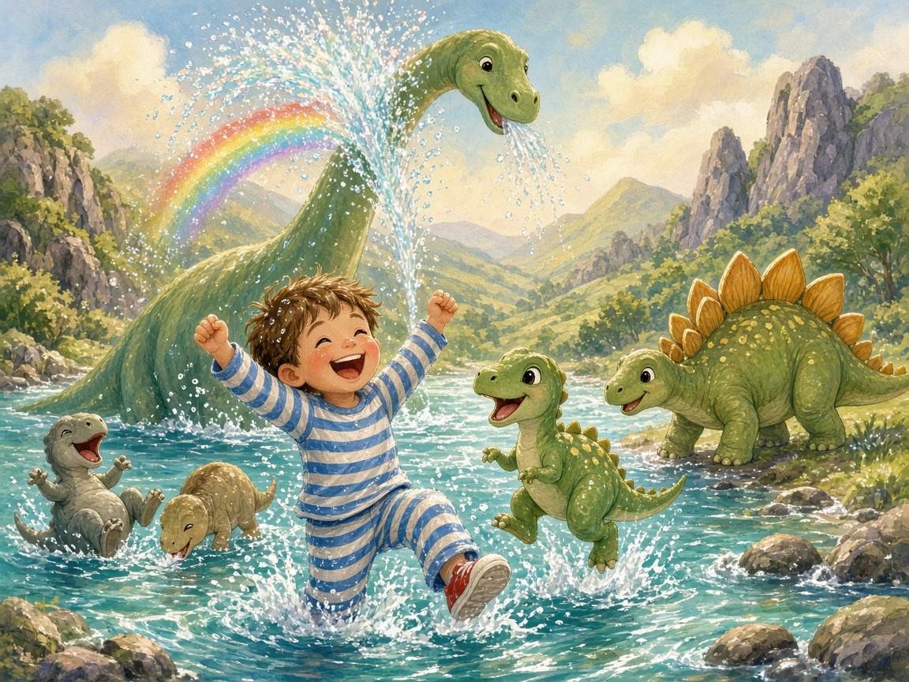

И тут...

**БУЛЬ! ЖУРЧ! ПЛЮХ!**

Речка вернулась!

Малыши пили и плюхались. Долговяз набрал полный рот воды и — **пш-ш-ш-ш!** — брызнул прямо на Максима.

Все смеялись.

---

## 10

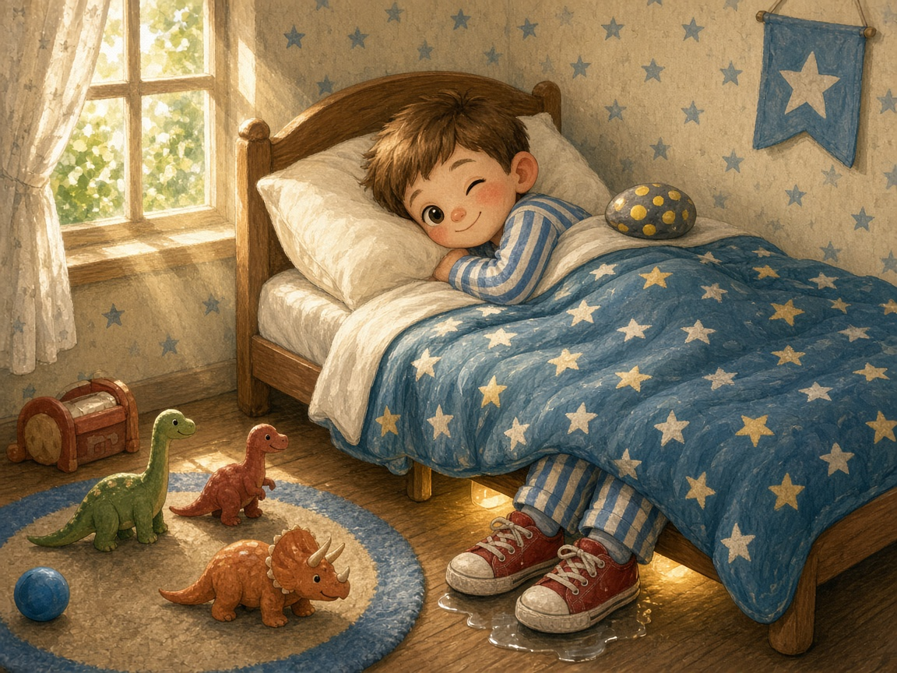

Шипастик отнёс Максима домой на спине.

Утром мама сказала:

— Максим, ты почему спишь в кроссовках?

А на подушке лежал маленький гладкий камешек. В жёлтых пятнышках.

Максим улыбнулся. Он знал: ночью опять постучат.

**Тук. Тук-тук.**

---

## Конец

Спокойной ночи, Максим!
